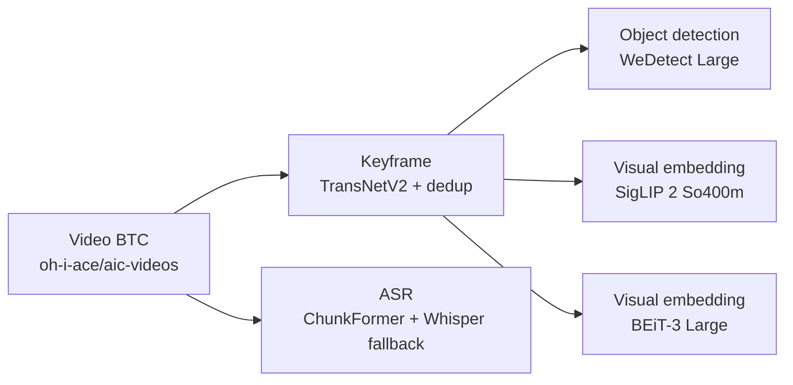

# Multimedia Video RAG

Kho mã quản lý các tác vụ **ingest và trích xuất artifact offline** cho dữ liệu
video AIC 2026. Các notebook đọc video hoặc keyframe từ Hugging Face, chạy suy
luận trên GPU của Google Colab/Kaggle, kiểm tra kết quả và lưu artifact trở lại
Hugging Face Hub theo một data contract thống nhất.

> [!IMPORTANT]
> Dự án hiện mới ở giai đoạn chuẩn bị dữ liệu. Kiến trúc retrieval hoàn chỉnh,
> vector database, fusion, reranking, API, giao diện và hạ tầng triển khai vẫn
> chưa được chốt.

## Phạm vi hiện tại

Dự án đang thực hiện:

- phát hiện shot và chọn keyframe;
- nhận dạng tiếng nói theo timeline video;
- phát hiện đối tượng trên keyframe;
- tạo visual embedding riêng cho từng model;
- kiểm tra schema, provenance và tính đầy đủ của artifact;
- hỗ trợ chạy lại an toàn sau khi phiên Colab/Kaggle bị ngắt.

Các nội dung chưa thuộc phạm vi đã triển khai:

- xây dựng chỉ mục tìm kiếm hoặc vector database;
- thiết kế query pipeline, fusion và reranking;
- ingest OCR hoặc caption;
- backend, frontend, API và deployment;
- benchmark để chọn kiến trúc retrieval cuối cùng.

## Luồng dữ liệu offline



ASR xử lý trực tiếp video gốc. OD và hai job visual embedding đọc cùng dataset
keyframe nhưng ghi vào ba dataset độc lập. Vector SigLIP 2 và BEiT-3 thuộc hai
không gian khác nhau, vì vậy không được ghép vector hoặc so cosine trực tiếp.

## Trạng thái artifact

| Module | Input | Model/phương pháp | Dataset output | Quyền xem | Trạng thái |
|---|---|---|---|---|---|
| Keyframe | Video BTC | TransNetV2, pHash và OpenCLIP dedup | [`aqpahm/aic2026-keyframes-transnetv2`](https://huggingface.co/datasets/aqpahm/aic2026-keyframes-transnetv2) | Public | Hoàn tất L21–L30 |
| ASR | Video BTC | `khanhld/chunkformer-rnnt-large-vie`, fallback `Systran/faster-whisper-large-v3` | `aqpahm/aic2026-asr-chunkformer-rnnt-large` | Private | Hoàn tất |
| Object detection | Keyframe | WeDetect Large, threshold `0.30`, core vocabulary 400 nhãn | `aqpahm/aic2026-od-wedetect-large` | Private | Hoàn tất |
| Visual embedding | Keyframe | `google/siglip2-so400m-patch16-384` | `aqpahm/aic2026-visual-siglip2-so400m` | Private | Hoàn tất |
| Visual embedding | Keyframe | BEiT-3 Large Patch16 384, COCO Retrieval | `aqpahm/aic2026-visual-beit3-large-coco-retrieval` | Private | Đang ingest |

Trạng thái trên phản ánh tiến độ vận hành hiện tại, không phải kết quả benchmark
hay quyết định chọn model cho hệ thống retrieval cuối cùng. Xem bản theo dõi chi
tiết tại [docs/project-status.md](docs/project-status.md).

## Data contract

Mỗi video dùng định danh `Lxx_Vxxx`. Artifact gắn với frame dùng khóa bền vững:

```text
frame_uid = "{video_id}:{frame_idx}"
```

`frame_idx` là chỉ số frame trong video gốc, bắt đầu từ 0. Không join dữ liệu chỉ
bằng `sample_n` hoặc tên ảnh vì các giá trị này có thể thay đổi khi trích xuất
lại keyframe.

| Module | Artifact bắt buộc cho mỗi video | Marker hoàn tất |
|---|---|---|
| Keyframe | `keyframes.tar`, `frames.parquet` | `_SUCCESS.json` |
| ASR | `asr.parquet`, `asr_chunks.parquet` | `_ASR_SUCCESS.json` |
| Object detection | `detections.parquet`, `frames.parquet` | `_OD_SUCCESS.json` |
| Visual embedding | `embeddings.safetensors`, `frames.parquet` | `_VISUAL_SUCCESS.json` |

Marker chỉ được công bố sau khi artifact đã được tạo, kiểm tra và upload thành
công. Notebook chỉ skip một video khi marker từ xa hợp lệ và các file bắt buộc
đều tồn tại. Danh sách hoàn tất được đối chiếu với video thực sự có trong archive
của BTC; ID bị khuyết trong dãy số không được xem là video thiếu.

Visual embedding được lưu dưới dạng FP16 đã L2-normalize:

| Dataset | Số chiều |
|---|---:|
| SigLIP 2 So400m | 1152 |
| BEiT-3 Large COCO Retrieval | 1024 |

Schema đầy đủ và quy tắc thay đổi version nằm tại
[docs/data-contracts.md](docs/data-contracts.md).

## Cấu trúc repository

```text
multimedia-video-rag/
├── notebooks/
│   ├── README.md                 # Hướng dẫn vận hành notebook
│   └── ingestion/                # Notebook nguồn sạch cho Colab/Kaggle
├── src/multimedia_video_rag/
│   └── ingestion/                # Contract và công cụ kiểm tra artifact
├── schemas/                      # JSON Schema cho success marker
├── scripts/                      # Kiểm tra và làm sạch notebook
├── tests/                        # Kiểm thử contract/validator
├── docs/
│   ├── data-contracts.md
│   ├── ingestion-standard.md
│   └── project-status.md
├── AGENTS.md                     # Quy ước làm việc trong repository
└── pyproject.toml
```

Repository chỉ lưu mã nguồn, schema và tài liệu. Video, keyframe, model weight,
embedding, cache, token và notebook đã chạy có output không được commit vào Git.

## Chạy notebook trên Colab hoặc Kaggle

1. Chọn notebook nguồn trong [`notebooks/ingestion`](notebooks/ingestion/).
2. Upload notebook lên Google Colab hoặc Kaggle.
3. Bật GPU và Internet cho phiên chạy.
4. Tạo secret `HF_TOKEN` có quyền đọc input và ghi output tương ứng.
5. Kiểm tra các biến cấu hình ở đầu notebook, đặc biệt là input/output repository
   và giới hạn pilot.
6. Chạy pilot trên một số ít video, kiểm tra artifact và marker trên Hugging Face.
7. Bỏ giới hạn pilot rồi chạy toàn bộ. Video đã có marker hợp lệ sẽ tự được skip.
8. Chạy audit cuối và chỉ coi job hoàn tất khi không còn video lỗi.

Notebook tự nhận diện runtime `colab`, `kaggle` hoặc `local`. Mỗi GPU có một
worker và một model replica: Colab với một T4 dùng một worker; Kaggle với hai T4
dùng hai worker. Batch size được điều chỉnh theo VRAM và tự giảm khi CUDA OOM.
GPU có thể tạm rảnh trong lúc tải archive, giải mã video, đọc TAR, ghi Parquet
hoặc upload mạng.

Hướng dẫn chi tiết cho từng notebook, cách pilot, resume và xử lý lỗi nằm tại
[notebooks/README.md](notebooks/README.md).

## Thiết lập phát triển cục bộ

Yêu cầu Python 3.12 và [uv](https://docs.astral.sh/uv/).

```powershell
uv sync --extra dev
```

Chạy các kiểm tra trước khi commit:

```powershell
uv run python scripts/check_notebooks.py
uv run ruff check .
uv run ruff format --check .
uv run pytest
```

Notebook trong repository phải sạch output, không có execution count và không
chứa secret. Nếu mang thay đổi từ notebook đã chạy trên cloud về, hãy thao tác
trên một bản sao rồi làm sạch trước khi commit:

```powershell
uv run python scripts/strip_notebook_outputs.py path/to/notebook.ipynb
```

## Nguyên tắc đóng góp

- Giữ mọi cấu hình vận hành quan trọng trong một cell cấu hình rõ ràng.
- Ghi input revision, model revision/checksum, tham số chính và schema version
  vào success marker.
- Không thay model, thuật toán hoặc schema chỉ để đồng bộ hình thức giữa notebook.
- Upload theo nhóm và retry có backoff để hạn chế lỗi mạng/rate limit.
- Dọn dữ liệu tạm sau từng video hoặc archive để tránh đầy disk phiên chạy.
- Cập nhật tài liệu và schema cùng lúc khi thay đổi contract.
- Không commit `HF_TOKEN` hoặc bất kỳ credential nào.

Đọc thêm [quy ước ingestion](docs/ingestion-standard.md) và
[quy ước làm việc](AGENTS.md) trước khi sửa pipeline.
