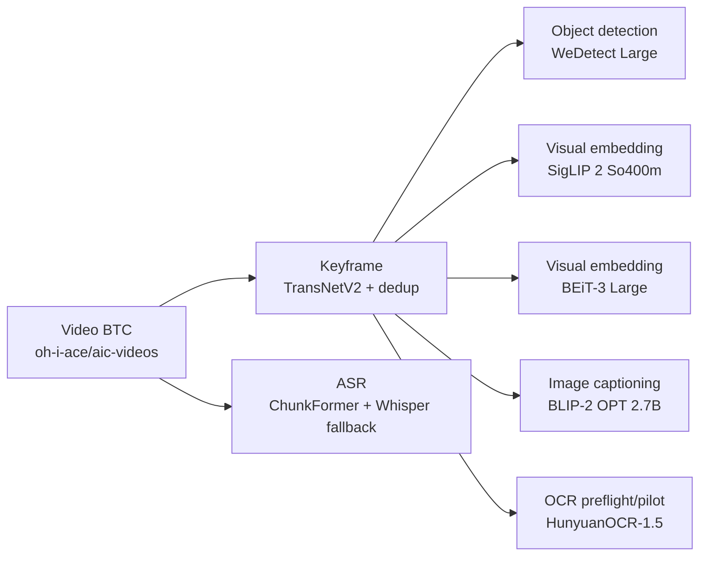

# Multimedia Video RAG

Kho mã quản lý các tác vụ **ingest và trích xuất artifact offline** cho dữ liệu
video AIC 2026. Các notebook đọc video hoặc keyframe từ Hugging Face, chạy suy
luận trên GPU của Google Colab/Kaggle, kiểm tra kết quả và lưu artifact trở lại
Hugging Face Hub theo một data contract thống nhất.

> [!IMPORTANT]
> Dữ liệu offline đã ingest xong phần lớn; retrieval mới ở mức **thử nghiệm để
> benchmark**. Kiến trúc retrieval hoàn chỉnh, vector database, fusion, reranking,
> API, giao diện và hạ tầng triển khai vẫn chưa được chốt.

## Phạm vi hiện tại

Dự án đang thực hiện:

- phát hiện shot và chọn keyframe;
- nhận dạng tiếng nói theo timeline video;
- phát hiện đối tượng trên keyframe;
- tạo visual embedding riêng cho từng model;
- ingest image captioning bằng BLIP-2 và chuẩn bị notebook OCR bằng HunyuanOCR-1.5
  (PP-OCRv6 medium giữ lại để đối chiếu);
- kiểm tra schema, provenance và tính đầy đủ của artifact;
- hỗ trợ chạy lại an toàn sau khi phiên Colab/Kaggle bị ngắt;
- package thử nghiệm `multimedia_video_rag.retrieval`: index FAISS + SQLite cục bộ,
  baseline tái hiện hai paper, công cụ đánh giá và web UI tìm kiếm cục bộ.

Các nội dung chưa thuộc phạm vi đã triển khai:

- chọn vector database và kiến trúc serving;
- chốt query pipeline, fusion và reranking;
- chạy OCR trên toàn bộ dữ liệu;
- backend/API dùng chung, deployment;
- benchmark có ground truth để chọn kiến trúc retrieval cuối cùng.

## Luồng dữ liệu offline


```mermaid
flowchart LR
    V[Video BTC<br/>oh-i-ace/aic-videos]
    KF[Keyframe<br/>TransNetV2 + dedup]
    ASR[ASR<br/>ChunkFormer + Whisper fallback]
    OD[Object detection<br/>WeDetect Large]
    S[Visual embedding<br/>SigLIP 2 So400m]
    B[Visual embedding<br/>BEiT-3 Large]
    C[Image captioning<br/>BLIP-2 OPT 2.7B]
    OCR[OCR preflight/pilot<br/>HunyuanOCR-1.5]

    V --> KF
    V --> ASR
    KF --> OD
    KF --> S
    KF --> B
    KF --> C
    KF --> OCR
```

ASR xử lý trực tiếp video gốc. OD, hai job visual embedding và notebook
captioning và OCR đọc cùng dataset keyframe; mỗi job ghi vào một dataset riêng.
Vector SigLIP 2 và BEiT-3 thuộc hai
không gian khác nhau, vì vậy không được ghép vector hoặc so cosine trực tiếp.

## Trạng thái artifact

| Module | Input | Model/phương pháp | Dataset output | Quyền xem | Trạng thái |
|---|---|---|---|---|---|
| Keyframe | Video BTC | TransNetV2, pHash và OpenCLIP dedup | [`aqpahm/aic2026-keyframes-transnetv2`](https://huggingface.co/datasets/aqpahm/aic2026-keyframes-transnetv2) | Public | Hoàn tất L21–L30 |
| ASR | Video BTC | `khanhld/chunkformer-rnnt-large-vie`, fallback `Systran/faster-whisper-large-v3` | `aqpahm/aic2026-asr-chunkformer-rnnt-large` | Private | Hoàn tất |
| Object detection | Keyframe | WeDetect Large, threshold `0.30`, core vocabulary 400 nhãn | `aqpahm/aic2026-od-wedetect-large` | Private | Hoàn tất |
| Visual embedding | Keyframe | `google/siglip2-so400m-patch16-384` | `aqpahm/aic2026-visual-siglip2-so400m` | Private | Hoàn tất |
| Visual embedding | Keyframe | BEiT-3 Large Patch16 384, COCO Retrieval | `aqpahm/aic2026-visual-beit3-large-coco-retrieval` | Private | Đã ingest hoàn tất |
| Image captioning | Keyframe | `Salesforce/blip2-opt-2.7b-coco` | `aqpahm/aic2026-caption-blip2-opt-2.7b-coco` | Private | Đã ingest hoàn tất |
| OCR | Keyframe | `tencent/HunyuanOCR` (1.5) text spotting qua vLLM 0.18.1 | `aqpahm/aic2026-ocr-hunyuanocr` (dự kiến) | Private (dự kiến) | Notebook sẵn sàng preflight/pilot; chưa chạy trên GPU, chưa có artifact |
| OCR (đối chiếu) | Keyframe | PP-OCRv6 medium detector + recognizer | `aqpahm/aic2026-ocr-ppocrv6-medium` (dự kiến) | Private (dự kiến) | Recognizer thiếu dấu hỏi/nặng tiếng Việt; chưa có artifact |

Trạng thái trên phản ánh tiến độ vận hành hiện tại, không phải kết quả benchmark
hay quyết định chọn model cho hệ thống retrieval cuối cùng. Xem bản theo dõi chi
tiết tại [docs/project-status.md](docs/project-status.md).

## Audit artifact trên Hugging Face

Đặt `HF_TOKEN` trong môi trường nếu các dataset là private, rồi chạy audit đầy
đủ. Danh sách video chuẩn được lấy trực tiếp từ các thư mục có thật trong dataset
keyframe; script không suy đoán các ID còn thiếu theo dãy số.

```powershell
$env:HF_TOKEN = "hf_..."
uv run python scripts/audit_hf_ingestion.py
```

Audit đầy đủ tải marker và các Parquet nhỏ để kiểm tra schema, số dòng,
`frame_uid`, timestamp, model/source provenance và hash caption. Kết quả nằm ở
`artifacts/ingestion-audit/audit-summary.json` và `audit-videos.parquet`; thư mục
`artifacts/` không được commit. Chế độ nhanh chỉ kiểm tra membership, file bắt
buộc và sự hiện diện của marker mà không tải nội dung từng marker:

```powershell
uv run python scripts/audit_hf_ingestion.py --quick
```

Mặc định script audit 8 video song song. Có thể giảm bằng `--workers 4` khi kết
nối mạng không ổn định hoặc khi Hugging Face báo rate limit.

Audit sâu một mẫu trước khi chạy toàn bộ:

```powershell
uv run python scripts/audit_hf_ingestion.py --video-id L21_V001 --video-id L30_V096
```

`--verify-large-hashes` còn tải toàn bộ `embeddings.safetensors` để đối chiếu
SHA-256, vì vậy chỉ bật khi cần audit sâu và có đủ băng thông/dung lượng cache.
Script trả exit code `1` nếu có bất kỳ video lỗi nào.

## Data contract

Mỗi video dùng định danh `Lxx_Vxxx`. Artifact gắn với frame dùng khóa bền vững:

```text
frame_uid = "{video_id}:{frame_idx}"
```

`frame_idx` là chỉ số frame trong video gốc, bắt đầu từ 0. Không join dữ liệu chỉ
bằng `sample_n` hoặc tên ảnh vì các giá trị này có thể thay đổi khi trích xuất
lại keyframe.

| Module | Artifact bắt buộc cho mỗi video | Marker hoàn tất |
|---|---|---|
| Keyframe | `keyframes.tar`, `frames.parquet` | `_SUCCESS.json` |
| ASR | `asr.parquet`, `asr_chunks.parquet` | `_ASR_SUCCESS.json` |
| Object detection | `detections.parquet`, `frames.parquet` | `_OD_SUCCESS.json` |
| Visual embedding | `embeddings.safetensors`, `frames.parquet` | `_VISUAL_SUCCESS.json` |
| Image captioning | `captions.parquet` | `_CAPTION_SUCCESS.json` |
| OCR | `ocr.parquet`, `ocr_regions.parquet` | `_OCR_SUCCESS.json` |

Marker chỉ được công bố sau khi artifact đã được tạo, kiểm tra và upload thành
công. Notebook chỉ skip một video khi marker từ xa hợp lệ và các file bắt buộc
đều tồn tại. Danh sách hoàn tất được đối chiếu với video thực sự có trong archive
của BTC; ID bị khuyết trong dãy số không được xem là video thiếu.

Visual embedding được lưu dưới dạng FP16 đã L2-normalize:

| Dataset | Số chiều |
|---|---:|
| SigLIP 2 So400m | 1152 |
| BEiT-3 Large COCO Retrieval | 1024 |

Schema đầy đủ và quy tắc thay đổi version nằm tại
[docs/data-contracts.md](docs/data-contracts.md).

## Retrieval thử nghiệm

Package `src/multimedia_video_rag/retrieval` dựng index cục bộ từ artifact đã
ingest (chỉ video có marker hợp lệ), chạy baseline và phục vụ web UI tìm kiếm
bằng SigLIP 2 + BEiT-3. Câu truy vấn được encode trên Colab/Kaggle nên máy local
không cần tải model.

```powershell
uv sync --extra dev
uv run python scripts/build_retrieval_index.py --output-dir indexes/dev
uv run python scripts/download_keyframes.py          # ảnh cho UI, ~51 GB
uv run python scripts/serve_ui.py --encoder-url <URL từ notebook encoder server>
```

Hướng dẫn đầy đủ, cấu hình so sánh và cách đánh giá nằm tại
[docs/retrieval-experiments.md](docs/retrieval-experiments.md). Mọi cấu hình trong
package là thử nghiệm, không phải quyết định kiến trúc.

## Cấu trúc repository

```text
multimedia-video-rag/
├── .github/workflows/ci.yml      # Chạy các kiểm tra bên dưới cho push/PR
├── notebooks/
│   ├── README.md                 # Hướng dẫn vận hành notebook
│   ├── ingestion/                # Notebook ingest sạch cho Colab/Kaggle
│   └── retrieval/                # Notebook encode query (batch và server)
├── src/multimedia_video_rag/
│   ├── ingestion/                # Contract, validator và audit artifact
│   └── retrieval/                # Index, tìm kiếm, baseline, đánh giá, web UI
├── scripts/                      # CLI: kiểm tra notebook, audit, build, search, UI
├── tests/                        # Kiểm thử contract, notebook và retrieval
├── docs/
│   ├── data-contracts.md
│   ├── ingestion-standard.md
│   ├── project-status.md
│   ├── retrieval-experiments.md
│   ├── evaluation/               # Mẫu file gán nhãn, tiêu chí chọn query
│   └── research/
├── AGENTS.md                     # Quy ước làm việc trong repository
└── pyproject.toml
```

Repository chỉ lưu mã nguồn, schema và tài liệu. Video, keyframe, model weight,
embedding, index, cache, token và notebook đã chạy có output không được commit
vào Git; các thư mục `data/`, `indexes/`, `artifacts/`, `models/` đã được ignore.

## Chạy notebook trên Colab hoặc Kaggle

1. Chọn notebook nguồn trong [`notebooks/ingestion`](notebooks/ingestion/).
2. Upload notebook lên Google Colab hoặc Kaggle.
3. Bật GPU và Internet cho phiên chạy.
4. Tạo secret `HF_TOKEN` có quyền đọc input và ghi output tương ứng.
5. Kiểm tra các biến cấu hình ở đầu notebook, đặc biệt là input/output repository
   và giới hạn pilot.
6. Chạy pilot trên một số ít video, kiểm tra artifact và marker trên Hugging Face.
7. Bỏ giới hạn pilot rồi chạy toàn bộ. Video đã có marker hợp lệ sẽ tự được skip.
8. Chạy audit cuối và chỉ coi job hoàn tất khi không còn video lỗi.

Notebook tự nhận diện runtime `colab`, `kaggle` hoặc `local`. Mỗi GPU có một
worker và một model replica: Colab với một T4 dùng một worker; Kaggle với hai T4
dùng hai worker. Batch size được điều chỉnh theo VRAM và tự giảm khi CUDA OOM.
GPU có thể tạm rảnh trong lúc tải archive, giải mã video, đọc TAR, ghi Parquet
hoặc upload mạng.

Hướng dẫn chi tiết cho từng notebook, cách pilot, resume và xử lý lỗi nằm tại
[notebooks/README.md](notebooks/README.md).

## Thiết lập phát triển cục bộ

Yêu cầu Python 3.12 và [uv](https://docs.astral.sh/uv/).

```powershell
uv sync --extra dev
```

Chạy các kiểm tra trước khi commit (CI chạy lại đúng các bước này cho mỗi push
lên `main` và mỗi pull request):

```powershell
uv run python scripts/check_notebooks.py
uv run ruff check .
uv run ruff format --check .
uv run pytest
```

Notebook trong repository phải sạch output, không có execution count và không
chứa secret. Nếu mang thay đổi từ notebook đã chạy trên cloud về, hãy thao tác
trên một bản sao rồi làm sạch trước khi commit:

```powershell
uv run python scripts/strip_notebook_outputs.py path/to/notebook.ipynb
```

## Nguyên tắc đóng góp

- Giữ mọi cấu hình vận hành quan trọng trong một cell cấu hình rõ ràng.
- Ghi input revision, model revision/checksum, tham số chính và schema version
  vào success marker.
- Không thay model, thuật toán hoặc schema chỉ để đồng bộ hình thức giữa notebook.
- Upload theo nhóm và retry có backoff để hạn chế lỗi mạng/rate limit.
- Dọn dữ liệu tạm sau từng video hoặc archive để tránh đầy disk phiên chạy.
- Cập nhật tài liệu và schema cùng lúc khi thay đổi contract.
- Không commit `HF_TOKEN` hoặc bất kỳ credential nào.

Đọc thêm [quy ước ingestion](docs/ingestion-standard.md) và
[quy ước làm việc](AGENTS.md) trước khi sửa pipeline.
