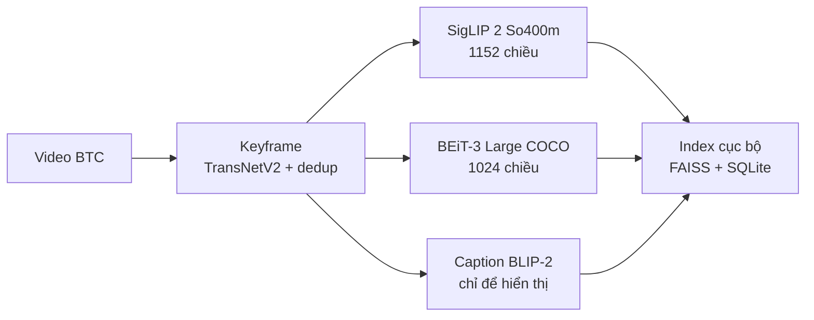

# Multimedia Video RAG

Nghiên cứu **text-to-video moment retrieval** trên dữ liệu AIC 2026: tìm khoảnh khắc
trong 873 video (335.477 keyframe) từ câu mô tả tiếng Anh, chỉ dựa trên hai image
embedding **SigLIP 2** và **BEiT-3**, không huấn luyện thêm.

> [!IMPORTANT]
> Mã retrieval trong repository là thử nghiệm để so sánh phương pháp. Fusion, kỹ thuật
> truy vấn và bộ tìm chuỗi thời gian đều chưa được chốt; chưa có ground truth.

## Dữ liệu


```mermaid
flowchart LR
    V[Video BTC] --> KF[Keyframe<br/>TransNetV2 + dedup]
    KF --> S[SigLIP 2 So400m<br/>1152 chiều]
    KF --> B[BEiT-3 Large COCO<br/>1024 chiều]
    KF --> C[Caption BLIP-2<br/>chỉ để hiển thị]
    S --> I[Index cục bộ<br/>FAISS + SQLite]
    B --> I
    C --> I
```

| Thành phần | Dataset Hugging Face | Notebook |
|---|---|---|
| Keyframe | `aqpahm/aic2026-keyframes-transnetv2` (public) | `extract-kf-transnetv2.ipynb` |
| SigLIP 2 | `aqpahm/aic2026-visual-siglip2-so400m` | `ingest-visual-siglip2-so400m.ipynb` |
| BEiT-3 | `aqpahm/aic2026-visual-beit3-large-coco-retrieval` | `ingest-visual-beit3-large-coco-retrieval.ipynb` |
| Caption (hiển thị) | `aqpahm/aic2026-caption-blip2-opt-2.7b-coco` | `ingest-caption-blip2-opt-2.7b-coco.ipynb` |

Vector SigLIP 2 và BEiT-3 thuộc hai không gian khác nhau, không được ghép hoặc so
cosine trực tiếp. Chi tiết schema: [docs/data-contracts.md](docs/data-contracts.md).

## Bắt đầu nhanh

Yêu cầu Python 3.12 và [uv](https://docs.astral.sh/uv/).

```powershell
uv sync --extra dev
$env:HF_TOKEN = "<token đọc các dataset aqpahm/aic2026-*>"
uv run python scripts/build_retrieval_index.py --output-dir indexes/dev
uv run python scripts/download_keyframes.py --workers 8     # ảnh để xem, ~51 GB
uv run python scripts/serve_ui.py                           # http://127.0.0.1:8800
```

Câu truy vấn được encode trên Colab/Kaggle bằng notebook trong `notebooks/retrieval/`,
nên máy local không cần tải model. Hướng dẫn đầy đủ (encode, web UI, baseline, so sánh
kỹ thuật truy vấn, gán nhãn): [docs/retrieval-experiments.md](docs/retrieval-experiments.md).

## Cấu trúc repository

```text
multimedia-video-rag/
├── notebooks/
│   ├── ingestion/            # Keyframe, SigLIP 2, BEiT-3, caption (Colab/Kaggle)
│   └── retrieval/            # Encode câu truy vấn: theo lô và server tương tác
├── src/multimedia_video_rag/
│   ├── ingestion/            # Schema artifact và kiểm tra
│   └── retrieval/            # Index, tìm kiếm, fusion, baseline, encoder, web UI
├── scripts/                  # Build index, tải ảnh, UI, baseline, so sánh kỹ thuật
├── tests/
├── docs/
│   ├── project-status.md     # Đã làm gì, còn thiếu gì
│   ├── retrieval-experiments.md
│   ├── data-contracts.md
│   ├── ingestion-standard.md # Quy ước viết notebook ingest
│   ├── evaluation/           # Tiêu chí chọn câu truy vấn, mẫu gán nhãn
│   └── research/             # Khảo sát tài liệu, khung TCR
├── AGENTS.md                 # Quy ước làm việc
└── pyproject.toml
```

Repository chỉ lưu mã nguồn, schema và tài liệu. `data/`, `indexes/`, `artifacts/`,
`models/` đã được ignore: không commit dữ liệu, vector, index, ảnh, token hoặc câu hỏi
của BTC.

## Kiểm tra

CI chạy các bước này cho mỗi push lên `main` và mỗi pull request:

```powershell
uv run python scripts/check_notebooks.py
uv run ruff check .
uv run ruff format --check .
uv run pytest
```

Notebook trong repository phải sạch output và không chứa secret; làm sạch bản chạy từ
cloud bằng `uv run python scripts/strip_notebook_outputs.py path/to/notebook.ipynb`.
