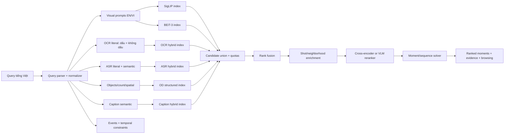

# Nghiên cứu kiến trúc hệ thống video retrieval cho AIC 2026

> **Trạng thái:** Đề xuất nghiên cứu, chưa phải quyết định kiến trúc.  
> **Ngày rà soát:** 2026-09-15  
> **Phạm vi:** Tổng hợp các paper trong `D:\Projects\Ref`, các hệ thống VBS/VCMR liên quan và rút ra kiến trúc ứng viên để benchmark trên dữ liệu, query AIC.

## 1. Kết luận chính

Pipeline ban đầu:

```text
query -> 2 visual embedding -> top keyframes -> OCR/ASR/caption/OD
      -> fusion -> rerank
```

có ưu điểm là dễ triển khai và tiết kiệm chi phí online, nhưng có một điểm yếu lớn: **visual retrieval trở thành cổng duy nhất quyết định recall**. Một frame có đúng chữ trên biển báo, đúng câu thoại hoặc đúng vật thể nhưng không nằm trong top visual sẽ bị loại trước khi OCR, ASR hay OD có cơ hội cứu lại. Đây là rủi ro đáng kể với query AIC vốn thường chứa tên riêng Việt Nam, chữ trên màn hình, lời nói, số lượng, quan hệ không gian và nhiều sự kiện nối tiếp.

Kiến trúc nên đem đi benchmark là **hybrid routed cascade**:

1. phân tích query thành biểu diễn có cấu trúc;
2. tìm kiếm độc lập trên các index visual, OCR, ASR, caption và OD;
3. tạo hợp các ứng viên có quota bảo toàn recall cho từng nhánh;
4. hợp nhất thứ hạng;
5. rerank một tập nhỏ bằng mô hình tương tác chéo;
6. gom theo shot và giải bài toán thời gian ở cấp moment hoặc chuỗi sự kiện;
7. trả kết quả kèm bằng chứng và hỗ trợ duyệt các frame lân cận.

Thiết kế này kết hợp ba ý đã xuất hiện nhiều lần trong các hệ thống mạnh: dual encoder cho lượt tìm kiếm rộng và nhanh, late fusion cho dữ liệu đa phương thức không cùng thang điểm, cross encoder/VLM chỉ dùng trên top-K để tăng precision.[^1][^2][^3]

## 2. Các kiến trúc đã khảo sát

### 2.1 Các paper trong thư mục Ref

| Công trình | Candidate generation | Fusion/rerank | Temporal | Bài học áp dụng |
|---|---|---|---|---|
| **Unified Framework for Multi-Granularity Models and Temporal Reranking** | BEiT-3 và CLIP tìm kiếm keyframe độc lập trên FAISS | Chuẩn hóa rồi ensemble; cộng điểm các frame lân cận | Tìm hai chiều bằng query đầu/cuối | Hai visual encoder có thể bổ sung nhau; neighborhood score giúp giảm frame trúng ngẫu nhiên.[^1] |
| **GRAB: Lightweight Moment Retrieval** | Keyframe search | SuperGlobal reranking để giảm chi phí | Adaptive Bidirectional Temporal Search | Tách truy hồi rộng khỏi định vị moment giúp kiểm soát tài nguyên.[^4] |
| **MADTempo** | CLIP-LAION; metadata OCR/ASR/OD/caption | Visual candidate được lọc/chấm bằng metadata và LLM context | Boundary retrieval, beam search cho các event trung gian | Phân rã query thành context và chuỗi event; chấm cả tính đầy đủ lẫn thứ tự.[^5] |
| **Cascaded Embedding-Reranking and Temporal-Aware Fusion** | BEiT-3 + SigLIP; OCR/ASR chạy song song | SRRF, BLIP-2 ITM trên top-100, trọng số theo query | Beam search với phạt khoảng cách | Gần nhất với tài sản hiện tại của dự án; chứng minh tính thực dụng của retrieval-then-rerank.[^2] |
| **Integrated Semantic and Temporal Alignment** | BEiT-3/Milvus và OCR/Elasticsearch | Rerank/filter theo nhánh | DANTE dùng dynamic programming, độ phức tạp tuyến tính theo số event × số frame | DP phù hợp khi event có thứ tự rõ; external image search giúp tên riêng/OOK.[^6] |
| **LLandMark** | CLIP, ASR/OCR, OD chạy song song | LLM lập `SearchPlan`, weighted fusion, answer synthesis | Tìm chuỗi theo nhiều bước | Giữ nguyên từ khóa Việt cho OCR/ASR, chuyển visual query thành mô tả tiếng Anh; landmark cần tri thức hình ảnh ngoài.[^7] |
| **NII-UIT at VBS 2025** | Nhiều visual model; OD metadata | Chuẩn hóa, late fusion; OD constraint | Dynamic temporal search quanh kết quả | Multimodal và browsing quan trọng, nhưng hard filter OD cần cơ chế fail-open vì detector có thể bỏ sót.[^8] |

Các paper AIC/VBS trên chủ yếu là **system paper**: chúng rất hữu ích để học thiết kế thực dụng, nhưng nhiều paper không có ablation đầy đủ trên cùng một benchmark. Vì vậy, lựa chọn thành phần cuối cùng vẫn phải dựa trên benchmark của chính dự án.

### 2.2 Bằng chứng từ VBS và VCMR bên ngoài Ref

- Đánh giá mở rộng VBS 2022 cho thấy cả ba hệ thống đầu đều dùng CLIP, nhưng mô hình text-image mạnh chưa đủ: browsing, image similarity và các loại query khác quyết định khả năng giải ổn định các known-item task.[^9]
- VISIONE 5.0 dùng ba biểu diễn ALADIN, CLIP ViT-L/14 và CLIP2Video, giữ index riêng rồi late-fuse bằng Reciprocal Rank Fusion; hệ thống còn có temporal query và image-to-image search.[^10]
- vitrivr-engine tách decoder, segmenter, extractor, retriever và aggregator bằng extension points; model server được tách khỏi retrieval engine qua REST. Đây là mẫu tốt cho khả năng thay model mà không sửa toàn bộ hệ thống.[^11]
- ReLoCLNet nêu rõ đánh đổi nền tảng: encode độc lập cho phép tiền tính toán và truy hồi nhanh trên toàn corpus, còn cross-modal interaction chính xác hơn nhưng quá đắt nếu chạy với mọi video.[^12]
- CONQUER dùng stage đầu để lấy top video, sau đó mới thực hiện query-aware multimodal fusion và moment localization. Điều này củng cố lựa chọn cascade nhiều tầng thay vì một model nặng chạy toàn bộ corpus.[^13]
- RRF là baseline hợp lý khi các nhánh có score không cùng thang và chưa có nhãn huấn luyện.[^14] Tuy vậy, nghiên cứu về hybrid retrieval cho thấy RRF nhạy với tham số và một phép kết hợp điểm được học có thể tốt hơn khi đã có tập validation đủ tin cậy.[^15]

## 3. So sánh ba phương án cho dự án

| Phương án | Recall | Chi phí online | Khả năng giải thích | Nhận định |
|---|---:|---:|---:|---|
| Visual gate rồi mới dùng metadata | Dễ mất OCR/ASR/OD hit | Thấp | Khá | Chỉ phù hợp làm baseline hoặc chế độ tiết kiệm |
| Chạy mọi nhánh với ngân sách lớn, fusion trực tiếp | Cao | Cao | Trung bình | Dễ lãng phí, score khó hiệu chỉnh, nhiễu từ nhánh không liên quan |
| **Query-adaptive hybrid cascade có rescue quota** | **Cao và kiểm soát được** | **Trung bình** | **Cao** | **Ứng viên tốt nhất để benchmark** |

`Query-adaptive` ở đây không có nghĩa LLM được quyền tắt hoàn toàn một modality. Router chỉ điều chỉnh trọng số và ngân sách. Mỗi nhánh có tín hiệu rõ trong query vẫn được một quota ứng viên tối thiểu; visual luôn chạy vì đây là tín hiệu nền.

## 4. Kiến trúc đề xuất để benchmark



### 4.1 Query understanding

Đầu ra của query parser nên là JSON có schema cố định, ví dụ:

```json
{
  "visual_queries": ["..."],
  "ocr_literals": ["KHU VỰC CẤM ĐẬU XE", "KHU VUC CAM DAU XE"],
  "asr_queries": ["..."],
  "caption_queries": ["..."],
  "objects": [{"label": "car", "min_count": 2, "hard": false}],
  "events": [{"id": "e1", "query": "..."}],
  "temporal_relations": [{"left": "e1", "op": "before", "right": "e2"}],
  "branch_weights": {"visual": 0.5, "ocr": 0.2, "asr": 0.1, "caption": 0.15, "od": 0.05}
}
```

Các nguyên tắc quan trọng:

- lưu cả query gốc lẫn query viết lại để debug;
- bảo toàn chuỗi trong dấu ngoặc kép, số, tên riêng, phủ định và quan hệ trước/sau;
- OCR tìm đồng thời bản tiếng Việt có dấu và bản không dấu; không xóa bản có dấu;
- ASR dùng cả lexical match và semantic match vì lời nói có thể được diễn đạt khác;
- visual prompt có thể dùng tiếng Anh để hợp với không gian huấn luyện của model, nhưng tên riêng Việt Nam phải được giữ trong nhánh text;
- parser phải có deterministic fallback khi LLM lỗi hoặc trả JSON sai.

### 4.2 Candidate generation

Mỗi index trả về `candidate_id`, score gốc, rank, modality và evidence. Các danh sách được union bằng khóa chuẩn `frame_uid`; ASR segment phải ánh xạ tới keyframe/shot gần nhất theo timestamp.

Ngân sách khởi đầu để benchmark, chưa phải cấu hình cuối:

| Nhánh | Top-K ban đầu |
|---|---:|
| SigLIP | 500–1.000 |
| BEiT-3 | 500–1.000 |
| Caption | 300–500 |
| OCR | 100–300, tăng khi có chuỗi literal |
| ASR | 100–300, tăng khi query thiên về lời nói |
| OD | 100–300 hoặc chỉ sinh score/constraint |
| Candidate union sau dedup | tối đa khoảng 1.500–2.000 |

Con số phải được chọn bằng đường cong Recall@K và latency. Không nên chọn chỉ theo cảm giác.

### 4.3 Fusion

Giai đoạn chưa có nhãn nên dùng **weighted RRF** trên rank, cộng bonus có giới hạn cho exact OCR/ASR và cho ứng viên xuất hiện ở nhiều nhánh. Không cộng trực tiếp cosine similarity, BM25 và detector confidence vì chúng không cùng ý nghĩa.

Khi đã có validation set, so sánh:

1. RRF/weighted RRF;
2. score calibration theo modality rồi weighted sum;
3. learning-to-rank nhỏ dùng các feature: rank, normalized score, exact match, overlap, object count, temporal consistency.

RRF nên là điểm xuất phát an toàn, không nên được xem là đáp án cuối trước khi đo.

### 4.4 Vai trò của OCR, ASR, caption và OD

- **OCR:** vừa sinh ứng viên độc lập, vừa là evidence mạnh khi query có chữ cụ thể. Exact phrase và số được ưu tiên; fuzzy/semantic chỉ hỗ trợ.
- **ASR:** sinh ứng viên ở cấp time interval; sau đó join sang shot/keyframe. Không ép transcript phải trùng keyframe đúng từng giây.
- **Caption:** sinh ứng viên semantic độc lập và bổ sung quan hệ, hành động, ngữ cảnh mà OD không biểu diễn được. Caption là dữ liệu nhiễu, cần giữ provenance và không được tự động lấn át hình ảnh gốc.
- **OD:** mặc định là soft feature/soft rerank. Chỉ dùng hard filter khi query có điều kiện rõ, label được hỗ trợ, confidence tốt và vẫn có `fail-open`/nút tắt filter. OD phù hợp với vật thể, số lượng và quan hệ không gian đơn giản; không thay caption.

Các model OCR/ASR/caption/OD chạy **offline trong ingestion**. Online chỉ query các artifact/index đã tạo; không cần nạp tất cả model ingest vào server truy vấn.

### 4.5 Reranking

Reranker chỉ nhận khoảng 100–300 ứng viên tốt nhất sau fusion. Interface nên độc lập với model:

```text
rerank(query_bundle, candidate_frames, evidence) -> ranked_candidates
```

Baseline hợp lý là BLIP-2 ITM vì paper gần bài toán đã dùng nó.[^2] Tuy nhiên cần benchmark với một reranker VLM mới hơn và một cấu hình nhẹ hơn; không chốt model từ kiến trúc. Reranker cần nhìn ảnh gốc, query và bằng chứng có provenance. Score cuối không nên dựa duy nhất vào câu trả lời tự do của VLM.

### 4.6 Temporal reasoning

Không trả các frame độc lập làm kết quả cuối:

- **Query một sự kiện:** gom frame theo shot, cộng điểm lân cận, merge các hit liên tiếp, rồi mở rộng hai phía để tìm moment.
- **Chuỗi có thứ tự đầy đủ:** dùng dynamic programming kiểu DANTE; có thể đạt `O(number_of_events × number_of_frames)` trong mỗi video.[^6]
- **Quan hệ linh hoạt hoặc mơ hồ:** dùng beam search với các constraint `before`, `after`, `within`, `max_gap` và gap penalty mềm.[^2][^5]
- **Nhiều event:** truy hồi ứng viên cho từng event trước, rồi tối ưu chuỗi. Không lấy top của toàn query và hy vọng các event tự xuất hiện đúng thứ tự.

### 4.7 Lớp lưu trữ và ranh giới dịch vụ

Kiến trúc logic nên độc lập với sản phẩm lưu trữ. Một cấu hình phù hợp để thử nghiệm là:

- **Qdrant:** hai named vector `siglip` và `beit3`, cùng payload định danh/timestamp;
- **OpenSearch/Elasticsearch:** OCR, ASR, caption với BM25, phrase, fuzzy và Vietnamese analyzer;
- **PostgreSQL:** canonical metadata, lineage, job/model/schema version và quan hệ video-shot-frame-segment;
- **object postings:** payload/relational table riêng, không biến label OD thành vector chính;
- **model service:** query encoder và reranker tách khỏi retrieval API để thay model hoặc chạy GPU khác mà không đổi engine.

Đây là cấu hình mục tiêu. Profile phát triển có thể thay PostgreSQL bằng SQLite và OpenSearch bằng FTS để chạy nhẹ, miễn giữ nguyên interface và data contract.

## 5. Những điểm không nên sao chép nguyên xi từ paper

1. **Hard filter OD trên toàn pipeline:** một false negative loại luôn đáp án đúng.
2. **Min-max theo từng danh sách nhỏ:** rất nhạy với outlier và làm score thay đổi theo candidate pool.
3. **Weighted average do LLM tự đoán:** hợp lý làm prior, nhưng cần giới hạn và đánh giá; LLM có thể route sai.
4. **Visual top-K làm tập ứng viên duy nhất:** làm mất hit OCR/ASR/caption.
5. **Một threshold dùng cho mọi query:** query có chữ, lời thoại và cảnh tổng quát cần ngân sách khác nhau.
6. **Dùng external web image mặc định:** tăng latency, phụ thuộc mạng và có thể lệch ý; chỉ bật cho landmark/OOK hoặc khi người dùng yêu cầu.
7. **Đưa mọi bằng chứng vào một prompt lớn:** chi phí tăng, khó debug và dễ để dữ liệu nhiễu chi phối kết quả.

## 6. Kế hoạch benchmark để quyết định kiến trúc

### 6.1 Tập đánh giá

Dùng query AIC 2025 và 2026 đã thu thập, phân tầng tối thiểu thành:

- visual scene/action;
- OCR literal/tên riêng/số;
- ASR/dialogue/narration;
- object/count/spatial;
- semantic relation phù hợp caption;
- landmark/OOK;
- single-event moment;
- multi-event temporal;
- phủ định hoặc query mơ hồ.

Mỗi query cần ground truth ở cấp video và khoảng thời gian/frame. Tách development và held-out test để tránh chỉnh trọng số trực tiếp trên tập báo cáo.

### 6.2 Các cấu hình ablation bắt buộc

| ID | Cấu hình | Câu hỏi trả lời |
|---|---|---|
| A | SigLIP | baseline visual |
| B | BEiT-3 | model thứ hai có bổ sung thật không |
| C | SigLIP + BEiT-3 | ensemble tăng recall bao nhiêu |
| D | C + metadata chỉ rerank visual top-K | đo pipeline ban đầu |
| E | candidate union đa nhánh + RRF | nhánh text/object cứu được bao nhiêu query |
| F | E + query router/rescue quota | giảm latency mà giữ recall không |
| G | F + cross-encoder/VLM reranker | precision tăng bao nhiêu |
| H | G + temporal solver | moment/sequence có đúng hơn không |

### 6.3 Chỉ số

- retrieval: Recall@K, MRR, nDCG@K, mAP;
- temporal: Recall@K tại các IoU threshold, mIoU/AxIoU và sequence success rate;
- theo nhóm query: báo cáo riêng visual/OCR/ASR/OD/caption/temporal;
- vận hành: P50/P95 latency, RAM/VRAM, kích thước index, throughput và lỗi timeout;
- oracle: union recall trước rerank để biết lỗi nằm ở retrieval hay reranker.

Điều kiện chốt kiến trúc nên là Pareto giữa chất lượng và latency, không chỉ một điểm trung bình. Một module chỉ được giữ khi tạo gain rõ trên nhóm query mục tiêu mà không làm hỏng đáng kể nhóm khác.

## 7. Thứ tự triển khai được khuyến nghị

1. Audit đầy đủ artifact SigLIP và BEiT-3 đã ingest; chọn và ingest OCR/caption theo contract chung.
2. Chuẩn hóa canonical IDs và timestamp join giữa keyframe, ASR, OCR, OD, caption.
3. Xây evaluation harness trước backend hoàn chỉnh.
4. Tạo hai visual index và đo A/B/C.
5. Thêm OCR/ASR/caption/OD retrieval độc lập, candidate union và RRF; đo D/E.
6. Thêm query parser với schema và deterministic fallback; đo F.
7. Benchmark 2–3 reranker trên cùng top-K; đo G.
8. Triển khai shot aggregation, DP và beam search theo loại temporal query; đo H.
9. Sau khi có kết quả mới viết ADR chốt database, fusion, reranker và service topology.

## 8. Quyết định tạm thời nên giữ

- Giữ các artifact của từng model độc lập như hiện tại; đây là lựa chọn đúng cho ablation và thay model.
- Dùng SigLIP + BEiT-3 làm hai visual retriever đầu tiên, nhưng chỉ giữ cả hai nếu C tốt hơn A/B trên query AIC.
- Xem OCR/ASR/caption là retriever có quyền tạo ứng viên, không chỉ metadata cho visual top-K.
- Xem OD là evidence/constraint có độ tin cậy, ưu tiên soft rerank.
- Dùng fusion theo rank làm baseline; chuyển sang calibration hoặc learning-to-rank khi có nhãn.
- Tách retrieval rộng, reranking chính xác và temporal reasoning thành ba tầng độc lập.
- Chưa chốt model caption, reranker hay database chỉ dựa trên system paper.

## Sources

[^1]: H. L. Tran et al., “Towards Efficient and Robust Moment Retrieval System: A Unified Framework for Multi-Granularity Models and Temporal Reranking,” CVPR Workshops 2025. https://openaccess.thecvf.com/content/CVPR2025W/IViSE/html/Tran_Towards_Efficient_and_Robust_Moment_Retrieval_System_A_Unified_Framework_CVPRW_2025_paper.html
[^2]: T. T. Le Ngo et al., “Unified Interactive Multimodal Moment Retrieval via Cascaded Embedding-Reranking and Temporal-Aware Score Fusion,” 2025. https://arxiv.org/abs/2512.12935
[^3]: G. Amato et al., “VISIONE 5.0: Enhanced User Interface and AI Models for VBS2024,” MMM 2024. https://doi.org/10.1007/978-3-031-53302-0_29
[^4]: T. A. Nguyen-Nhu et al., “A Lightweight Moment Retrieval System with Global Re-Ranking and Robust Adaptive Bidirectional Temporal Search,” CVPR Workshops 2025. https://openaccess.thecvf.com/content/CVPR2025W/IViSE/papers/Nguyen-Nhu_A_Lightweight_Moment_Retrieval_System_with_Global_Re-Ranking_and_Robust_CVPRW_2025_paper.pdf
[^5]: H. A. Vu et al., “MADTempo: An Interactive System for Multi-Event Temporal Video Retrieval with Query Augmentation,” 2025. https://arxiv.org/abs/2512.12929
[^6]: T. D. Luu et al., “Integrated Semantic and Temporal Alignment for Interactive Video Retrieval,” 2025. https://arxiv.org/abs/2512.13169
[^7]: M. C. Phung et al., “LLandMark: A Multi-Agent Framework for Landmark-Aware Multimodal Interactive Video Retrieval,” 2026. https://arxiv.org/abs/2603.02888
[^8]: B. T. Gia et al., “NII-UIT at VBS2025: Multimodal Video Retrieval with LLM Integration and Dynamic Temporal Search,” MMM 2025. https://doi.org/10.1007/978-981-96-2074-6_38
[^9]: S. Heller et al., “Interactive multimodal video search: an extended post-evaluation for the VBS 2022 competition,” International Journal of Multimedia Information Retrieval, 2024. https://link.springer.com/article/10.1007/s13735-024-00325-9
[^10]: G. Amato et al., “VISIONE 5.0: Toward Evaluation with Novice Users,” CBMI 2024. https://doi.org/10.1109/CBMI62980.2024.10859203
[^11]: L. Rossetto and R. Gasser, “A New Retrieval Engine for vitrivr,” MMM 2024. https://dbis.dmi.unibas.ch/publications/2024/VBS24-vitrivr/paper.pdf
[^12]: H. Zhang et al., “Video Corpus Moment Retrieval with Contrastive Learning,” SIGIR 2021. https://arxiv.org/abs/2105.06247
[^13]: Z. Hou, C. W. Ngo, and W. K. Chan, “CONQUER: Contextual Query-aware Ranking for Video Corpus Moment Retrieval,” ACM Multimedia 2021. https://arxiv.org/abs/2109.10016
[^14]: G. V. Cormack, C. L. A. Clarke, and S. Büttcher, “Reciprocal Rank Fusion Outperforms Condorcet and Individual Rank Learning Methods,” SIGIR 2009. https://research.google/pubs/reciprocal-rank-fusion-outperforms-condorcet-and-individual-rank-learning-methods/
[^15]: S. Bruch, S. Gai, and A. Ingber, “An Analysis of Fusion Functions for Hybrid Retrieval,” ACM TOIS 2023. https://arxiv.org/abs/2210.11934

