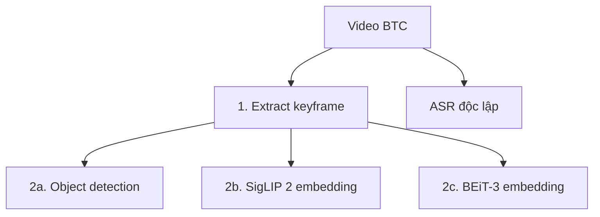

# Hướng dẫn notebook ingest/extract

Thư mục [`ingestion`](ingestion/) chứa các notebook nguồn dùng để tạo artifact
offline trên Google Colab hoặc Kaggle. Mỗi notebook tự cài dependency, nhận diện
runtime, đọc secret, tải input từ Hugging Face, chạy inference, kiểm tra artifact
và upload kết quả theo lô.

Các notebook này chưa xây chỉ mục tìm kiếm và chưa thể hiện một kiến trúc video
retrieval đã chốt. Bản notebook tải xuống sau khi chạy cloud chỉ dùng làm log cá
nhân và được giữ ngoài repository.

## Danh mục notebook

| Notebook | Input | Model/phương pháp | Output | Artifact mỗi video |
|---|---|---|---|---|
| [`extract-kf-transnetv2.ipynb`](ingestion/extract-kf-transnetv2.ipynb) | `oh-i-ace/aic-videos` | TransNetV2 + pHash/OpenCLIP dedup | `aqpahm/aic2026-keyframes-transnetv2` | `keyframes.tar`, `frames.parquet`, `_SUCCESS.json` |
| [`ingest-asr-chunkformer-rnnt-large.ipynb`](ingestion/ingest-asr-chunkformer-rnnt-large.ipynb) | `oh-i-ace/aic-videos` | ChunkFormer RNNT Large Vietnamese + Whisper Large v3 fallback | `aqpahm/aic2026-asr-chunkformer-rnnt-large` | `asr.parquet`, `asr_chunks.parquet`, `_ASR_SUCCESS.json` |
| [`ingest-od-wedetect-large.ipynb`](ingestion/ingest-od-wedetect-large.ipynb) | Dataset keyframe | WeDetect Large, vocabulary AIC 400 nhãn | `aqpahm/aic2026-od-wedetect-large` | `detections.parquet`, `frames.parquet`, `_OD_SUCCESS.json` |
| [`ingest-visual-siglip2-so400m.ipynb`](ingestion/ingest-visual-siglip2-so400m.ipynb) | Dataset keyframe | SigLIP 2 So400m Patch16 384 | `aqpahm/aic2026-visual-siglip2-so400m` | `embeddings.safetensors`, `frames.parquet`, `_VISUAL_SUCCESS.json` |
| [`ingest-visual-beit3-large-coco-retrieval.ipynb`](ingestion/ingest-visual-beit3-large-coco-retrieval.ipynb) | Dataset keyframe | BEiT-3 Large Patch16 384, COCO Retrieval | `aqpahm/aic2026-visual-beit3-large-coco-retrieval` | `embeddings.safetensors`, `frames.parquet`, `_VISUAL_SUCCESS.json` |

## Thứ tự phụ thuộc



- Keyframe phải hoàn tất trước OD, SigLIP 2 và BEiT-3.
- ASR đọc video gốc nên có thể chạy độc lập hoặc song song với keyframe.
- OD, SigLIP 2 và BEiT-3 không phụ thuộc lẫn nhau.
- Hai visual model phải ghi vào hai dataset riêng vì số chiều và không gian
  embedding khác nhau.

## Chuẩn bị runtime

### Google Colab

1. Tải notebook nguồn lên Colab.
2. Chọn **Runtime → Change runtime type → T4 GPU**.
3. Bật Internet nếu tài khoản/runtime yêu cầu.
4. Trong **Secrets**, thêm `HF_TOKEN` và bật quyền truy cập notebook.
5. Chạy từ cell đầu tiên theo đúng thứ tự.

### Kaggle

1. Import notebook nguồn vào Kaggle Notebook.
2. Trong **Session options**, bật GPU và Internet.
3. Chọn hai T4 nếu Kaggle cung cấp tùy chọn đó.
4. Trong **Add-ons → Secrets**, thêm `HF_TOKEN` và cấp quyền sử dụng.
5. Chạy từ cell đầu tiên theo đúng thứ tự.

Token cần quyền đọc repository input. Những job ghi vào dataset private cần thêm
quyền ghi đúng repository output. Không dán token trực tiếp vào cell, log hoặc
file notebook.

## Cấu hình trước khi chạy

Mỗi notebook có một cell cấu hình tập trung. Tên biến có thể khác nhẹ theo job,
nhưng cần kiểm tra các nhóm sau:

| Nhóm cấu hình | Ý nghĩa |
|---|---|
| Input repository/revision | Nguồn dữ liệu và revision dùng cho lần chạy |
| Output repository | Dataset nhận artifact |
| Model ID/revision/checksum | Model và phiên bản có thể tái lập |
| Archive selection | Danh sách archive thực tế cần xử lý |
| Pilot limit | Giới hạn số video để kiểm tra trước khi chạy toàn bộ |
| Batch/upload size | Kích thước inference batch và số video mỗi commit |
| Threshold | Ngưỡng của thuật toán, nếu notebook có sử dụng |
| Strict validation | Mức kiểm tra artifact từ xa khi resume |

Không đổi tên output repository giữa chừng nếu muốn notebook nhận ra artifact đã
có. Khi thay model, source revision, schema hoặc tham số ảnh hưởng kết quả, marker
cũ có thể không còn hợp lệ và cần một dataset/version mới.

## Pilot, chạy toàn bộ và resume

Quy trình vận hành đề xuất:

1. Đặt giới hạn pilot từ 1–5 video nếu notebook hỗ trợ.
2. Chạy notebook và mở một vài Parquet/marker trên Hugging Face để kiểm tra.
3. Xác nhận số dòng, timestamp, model ID, source revision và file bắt buộc.
4. Bỏ giới hạn pilot (`None`) rồi chạy lại từ đầu notebook.
5. Notebook kiểm tra output từ xa và skip video có marker hợp lệ.
6. Nếu runtime ngắt, tạo phiên mới và chạy lại toàn bộ cell; job tiếp tục từ
   video chưa hoàn tất.
7. Đọc báo cáo audit cuối trước khi kết luận job đã xong.

Không dựa vào việc thư mục xuất hiện trên Hugging Face để kết luận thành công.
Một thư mục chỉ hợp lệ khi marker và toàn bộ artifact bắt buộc khớp contract.

## Sử dụng GPU

Các notebook tự lấy số GPU bằng `torch.cuda.device_count()`:

- Colab một T4: một worker và một model replica;
- Kaggle hai T4: hai worker độc lập, mỗi worker giữ một GPU;
- batch khởi tạo theo cấu hình/VRAM và tự giảm khi CUDA OOM;
- upload được gom theo nhóm và thực hiện ngoài GPU worker để tránh nhiều worker
  cùng commit lên một repository.

GPU utilization không phải lúc nào cũng đạt 100%. Các bước tải archive, giải mã
video, giải nén TAR, ghi Parquet, nén artifact và upload chủ yếu dùng CPU, disk
hoặc mạng. Với một GPU, các bước này có thể trở thành nút thắt dù CUDA hoạt động
bình thường.

## Chi tiết từng notebook

### Keyframe — TransNetV2

- Xử lý 14 archive từ L21 đến L30, trong đó L26 gồm các phần `a`–`e`.
- Phát hiện ranh giới shot bằng TransNetV2 với `CUT_THRESHOLD = 0.50`.
- Loại frame gần trùng bằng pHash (`PHASH_DISTANCE = 6`) và OpenCLIP ViT-B/32
  (`COSINE_THRESHOLD = 0.965`).
- Upload theo nhóm 3 video để giảm số commit lên Hugging Face.
- Audit theo thành viên thật trong ZIP; không yêu cầu dãy `Vxxx` phải liên tục.

### ASR — ChunkFormer RNNT Large Vietnamese

- Model chính: `khanhld/chunkformer-rnnt-large-vie`.
- Fallback cho ca model chính không tạo được transcript:
  `Systran/faster-whisper-large-v3`.
- Kết quả giữ cả text gốc, text chuẩn hóa có dấu và text không dấu.
- Segment gắn với `start_sec`, `end_sec` và `timestamp_sec` trên video gốc.
- Video thật sự không có lời nói được biểu diễn rõ trong marker; không tạo một
  transcript giả để vượt qua audit.

### Object detection — WeDetect Large

- Model: WeDetect Large từ repository `fushh7/WeDetect`.
- Kích thước ảnh suy luận: 1280.
- Confidence threshold: `0.30`.
- Core vocabulary: `aic-query-2025-2026-v1-400`, gồm 400 khái niệm với nhãn
  tiếng Anh, Việt và Trung phục vụ đối chiếu sau này.
- Batch khởi tạo là 2 và tự chia đôi khi gặp CUDA OOM.
- Frame có 0 detection hợp lệ được ghi `empty_valid`, không bị xem là lỗi.

### Visual embedding — SigLIP 2 So400m

- Model: `google/siglip2-so400m-patch16-384`.
- Batch khởi tạo: 16; tự giảm khi CUDA OOM.
- Vector đầu ra: 1152 chiều, FP16 và đã L2-normalize.
- Thứ tự tensor được ánh xạ chính xác bằng cột `embedding_row` trong
  `frames.parquet`.

### Visual embedding — BEiT-3 Large COCO Retrieval

- Model định danh: `microsoft/beit3-large-patch16-384-coco-retrieval`.
- Tải source UniLM và checkpoint chính thức; notebook có bootstrap TorchScale
  cho môi trường Colab/Kaggle.
- Batch khởi tạo: 16; tự giảm khi CUDA OOM.
- Vector đầu ra: 1024 chiều, FP16 và đã L2-normalize.
- Có smoke test trên từng GPU trước khi bắt đầu toàn bộ workload.

## Điều kiện hoàn tất

Audit cuối phải thỏa cả ba điều kiện:

1. Mọi video thực sự có trong archive được quan sát trong lần chạy hoặc đã có
   marker từ xa hợp lệ.
2. Không còn video failure hoặc archive failure chưa được xử lý.
3. Marker và các artifact bắt buộc có cùng schema, model/source provenance và
   số dòng nhất quán.

Một archive tải thành công không có nghĩa toàn bộ video bên trong đã ingest
thành công. Một lệnh upload báo thành công cũng chưa đủ nếu marker hoặc file bắt
buộc không qua validation.

## Xử lý sự cố thường gặp

| Hiện tượng | Nguyên nhân thường gặp | Cách xử lý |
|---|---|---|
| HTTP 429 khi upload | Vượt giới hạn số commit Hugging Face | Giữ upload theo lô, chờ rate limit hết rồi chạy lại; marker hợp lệ sẽ được skip |
| HTTP 5xx hoặc timeout | Hugging Face/mạng tạm thời lỗi | Để retry/backoff chạy; nếu phiên ngắt, khởi động runtime mới và resume |
| CUDA OOM | Batch quá lớn hoặc VRAM phân mảnh | Notebook tự giảm batch; nếu vẫn lỗi, restart runtime và giảm batch khởi tạo |
| GPU hiển thị 0% | Job đang tải, decode, ghi file hoặc upload | Kiểm tra log bước hiện tại và dung lượng disk/network trước khi kết luận bị treo |
| Download archive dừng lâu | Mạng chậm, Xet reconstruction hoặc disk gần đầy | Kiểm tra tốc độ mạng/disk; restart và resume nếu không còn tiến triển |
| Marker có nhưng dữ liệu sai/thiếu | Marker cũ hoặc upload dở | Bật validation chặt hơn, xóa đúng output video lỗi rồi chạy lại |
| Model trả kết quả rỗng | Nội dung thật sự rỗng hoặc model thất bại | Giữ trạng thái rỗng hợp lệ khi có bằng chứng; dùng fallback theo logic của notebook |
| Thiếu package sau khi Colab cập nhật | Runtime image thay đổi | Chạy lại cell cài dependency và restart runtime nếu cell yêu cầu |

## Đồng bộ thay đổi từ cloud về repository

Notebook trong `ingestion/` phải là bản nguồn sạch. Nếu bạn sửa logic trực tiếp
trên Colab/Kaggle:

1. download notebook đã chạy;
2. tạo một bản sao dành cho source;
3. xóa output và execution count;
4. kiểm tra không còn token, đường dẫn tạm cá nhân hoặc log dung lượng lớn;
5. thay đúng notebook nguồn và chạy kiểm tra cục bộ;
6. giữ bản có output ở ngoài repository.

Có thể làm sạch bản sao bằng:

```powershell
uv run python scripts/strip_notebook_outputs.py path/to/notebook.ipynb
uv run python scripts/check_notebooks.py
```

## Checklist khi thêm hoặc sửa notebook

- [ ] Tên file mô tả đúng module và model.
- [ ] Input/output repository và revision được khai báo tập trung.
- [ ] Model ID, revision/checksum và tham số quan trọng được ghi vào marker.
- [ ] Không chứa secret, output cell hoặc execution count.
- [ ] Có pilot limit, retry/backoff, upload theo lô và dọn thư mục tạm.
- [ ] Có kiểm tra artifact trước khi công bố marker.
- [ ] Resume chỉ skip marker hợp lệ.
- [ ] Audit dựa trên video thật trong archive.
- [ ] Hỗ trợ đúng số GPU có sẵn và xử lý CUDA OOM.
- [ ] Data contract và tài liệu được cập nhật nếu schema thay đổi.

Xem thêm [quy ước ingestion](../docs/ingestion-standard.md) và
[data contract](../docs/data-contracts.md).
